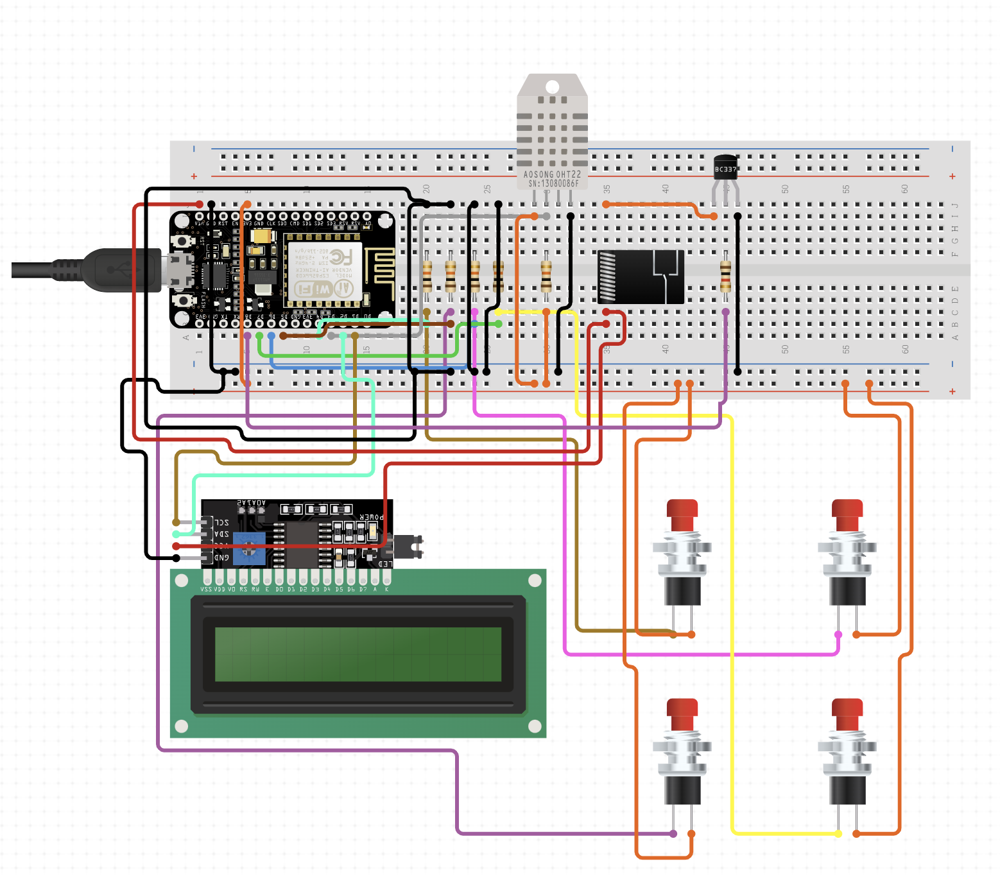

# nodemcu-thermostat

This is the repo for the thermostat main station

## Components

* Nodemcu (esp8266) microcontroller
* DHT11
* 10K Ohm resistor (for DHT11)
* LCD Display Screen 16x2 I2C
* Relay SPDT
* Transistor NPN BC337
* Momentary push button (x4)
* 10k Ohm resistor (x5) (for DHT11 and buttons)
* 1K Ohm resistor (for transistor)

## Schematic

